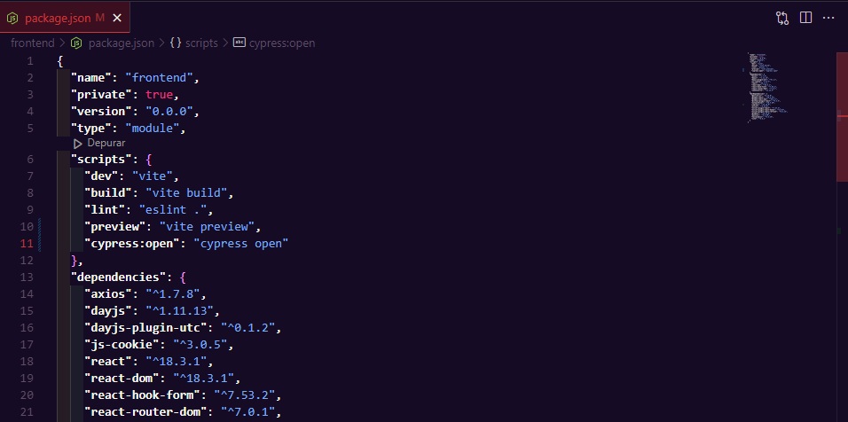
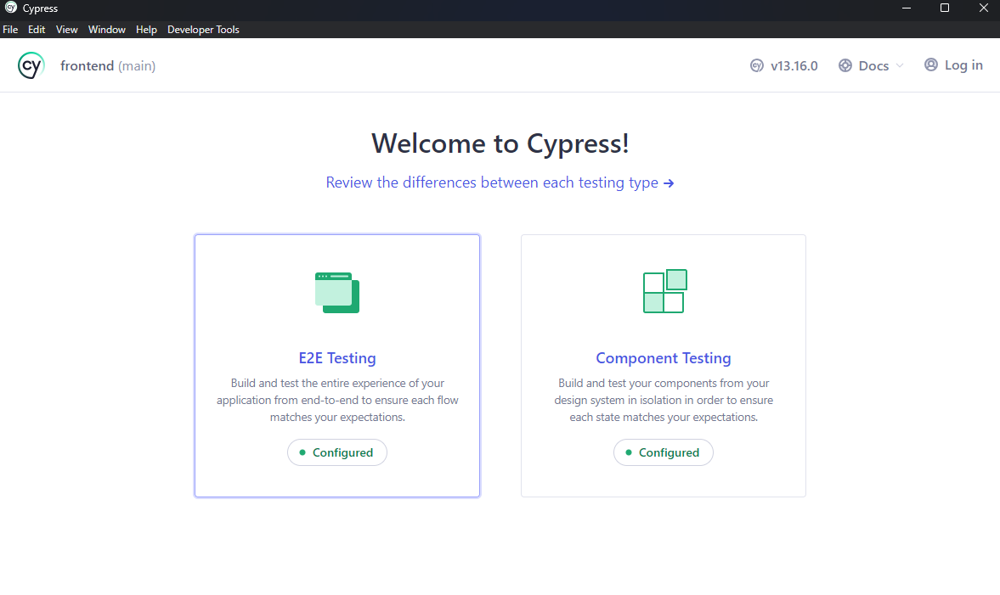
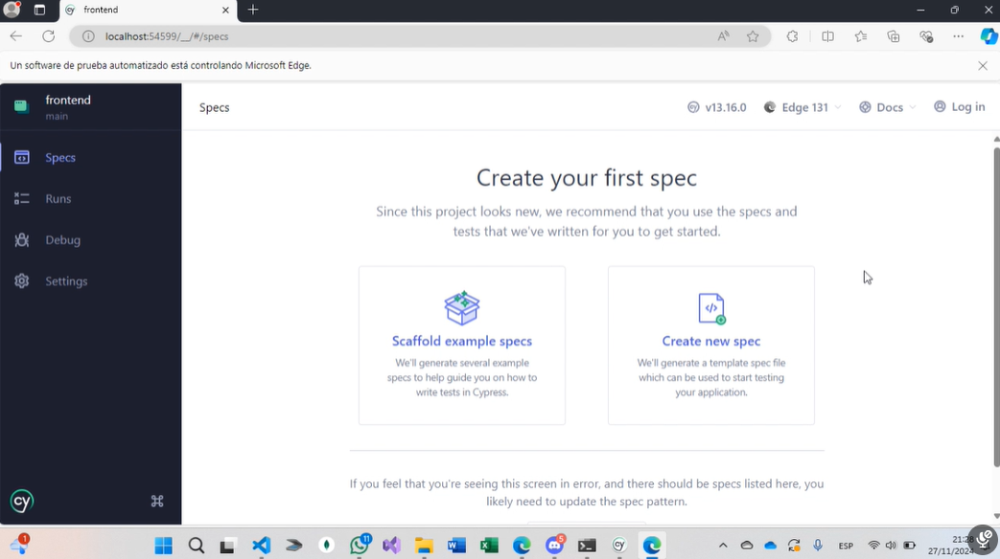

# Proyecto de Aplicación API y Cypress


## Requisitos Previos

Antes de empezar, asegúrate de tener las siguientes herramientas instaladas en tu máquina:

- [Git](https://git-scm.com/)
- [Node.js](https://nodejs.org/) (recomendado: versión 14 o superior)
- [npm](https://www.npmjs.com/) 

## Clonar el Repositorio

Primero, clona este repositorio en tu máquina local usando Git:

```bash
git clone https://github.com/YormanOna/Repositorio_Cypress.git
cd repositorio
```
## Configuración del Backend
1) Navega al directorio del backend:
```bash
cd backend
```
2) Instala las dependencias necesarias:
```bash
npm install
```
3) Inicia el servidor del backend:
```bash
npm install -g nodemon
nodemon index.js
```

## Configuración del Frontend
1) Navega al directorio del frontend:
```bash
cd frontend
```
2) Instala las dependencias necesarias:
```bash
npm install
```
3) Inicia la aplicación de React con Vite::
```bash
npm run dev
```
Esto debería abrir la aplicación en http://localhost:5173

**Ejecutar el programa** \
Nota: Asegúrate de que tanto el frontend como el backend estén corriendo.

## Descargar Cypress
1) Navega al directorio del frontend (o backend) donde quieres instalar Cypress, en este caso preferible en el frontend
2) Instala Cypress usando npm:
```bash
npm install cypress --save-dev
```
   Esto instalará Cypress como una dependencia de desarrollo en el proyecto

3) Asegúrate de tener la siguiente configuración en el archivo package.json para poder usar Cypress:

```bash
{
  "name": "frontend",
  "private": true,
  "version": "0.0.0",
  "type": "module",
  "scripts": {
    "dev": "vite",
    "build": "vite build",
    "lint": "eslint .",
    "preview": "vite preview",
    "cypress:open": "cypress open"
  }
}
```
4) Abre Cypress:
```bash
npm run cypress:open
```
5) Escoger la opcion E2E, esperar y luego darle a continuar 

6) Seleccionar el navegador de su gusto y esperar a que se abra la pagina de cypress en el navegador escogido

7) Listo esta listo para ser usado

